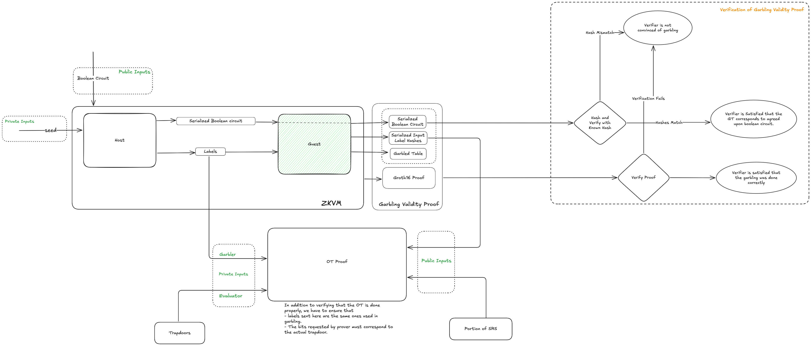

# Garbled Ciruits and its Valdity Proofs

[](https://opensource.org/licenses/MIT)
[](https://opensource.org/licenses/apache-2-0)
[](https://github.com/alpenlabs/verifiable-garbling/actions)
[](https://docs.rs/rust-template)

This is an implementation of garbled circuit with free-xor optimization as well as a zk proof of correct garbling using risczero zkvm.

Our garbling circuit protocol needs to maliciously secure.
We need to ensure that the garbler is construting the garbling table for the agreed upon boolean circuit and also ensure that the table is constructed correctly.

This means that even before evaluation, anyone can ensure that the evaluation will go through and will correspond the agreed upon boolean circuit.



The above diagram can be accessed by the [permalink](https://excalidraw.com/#json=am-3JTklHgd7PQt2yk6Rd,WMfQXMzK2kjoWY0FMF0lpA) or excalidraw file `gc_flow.excalidraw`

## Crates and Directories

- **circuit-utils**\
   Utilities to work with boolean circuit. Includes a parser and way to generate random boolean circuits with desired number of gates.
- **circuits**\
  Contains few example circuits and their description
- **gen_inputs**\
    generates input to be fed into bento
- **garble**\
  the main crate that parses bristol fashion files and generates garbled tables
- **validityproof**\
  Generates proof using risc0
- **logs**\
  Stores info of runs of proof generation

## Generating garbled tables and proof

### running on CPU or Single GPU

To generate the garbled table and proof that garbling was done correctly using risc0 , cd into the gc-verifiability and run

```{bash}
RUST_LOG=info RISC0_INFO=1 cargo run -p validityproof <boolean_file> <seed_file>
```

The `boolean_file` is representation of the boolen circuit in bristol fashion as detailed [here] (https://nigelsmart.github.io/MPC-Circuits/)

The `seed_file` is a 32 byte values used to initialize the CS-RNG to generate the labels.

```{bash}
RUST_LOG=info RISC0_INFO=1 cargo run -p validityproof circuits/example1/example1.bristol garble/seed.bin
```

If you only want to generate mock tests and get details of cycle counts, pass the env variable `RISC0_DEV_MODE=1`

Benchmarks and estimates of time and cost of producing proofs is at [the google sheets](https://docs.google.com/spreadsheets/d/1eevdDvaPIOrKF8rlpQFpkSJ2ttlDV_-BcC1MkK_ywR4/edit?gid=855613280#gid=855613280).

### Running in Multi GPU setups

To get multi GPU proof generai, we have to ensure that the STARK proof for the segments are being distributed to the GPUs and then collected. This orchastration is handled by [bento](https://github.com/risc0/risc0/tree/main/bento).

The steps to setup bento are:

1. (Optional) Spin up an aws instance
    - ensure atleast 100 gb persistant storage
    - choose Ubuntu 22.04
    - use some multi gpu instance type like g6.12x

2. Install build dependencies and `just`

    ```bash
    sudo apt update
    sudo apt upgrade
    sudo apt install build-essential
    sudo snap install just --classic
    ```

3. Install nvtop

    ```bash
    sudo apt install nvtop
    ```

4. Install rust (Follow [official installation guide](https://www.rust-lang.org/tools/install) for more detailed instructions)

    ```bash
    curl --proto '=https' --tlsv1.2 -sSf https://sh.rustup.rs | sh
    ```

5. Install risczero (Follow [official installation guide](https://dev.risczero.com/api/zkvm/install) for more detailed instructions)

    ```bash
    curl -L https://risczero.com/install | bash
    ```

    ```bash
    rzup install cargo-risczero 2.0.2
    ```

    ```bash
    rzup install rust
    ```

6. Install `bento_cli` using

    ```bash
    cargo install --git https://github.com/alpenlabs/risc0 --branch mukesh/add_bento_to_v2.0 bento-client --bin bento_cli
    ```

    Note this installs `bento_cli` from a fork which is to ensure that the version of risczero expectd by bento match with risczero installed previously.

7. Clone the boundless repo to get the docker compose files and select branch.

    ```bash
    git clone https://github.com/alpenlabs/boundless
    cd boundless
    git checkout mukesh/multiple_gpu

    ```

    Note: This has compose.yml configured for 4 GPUs. You can change it depending on your device by updating the compose.yml with instructions provided in the [docs](https://docs.beboundless.xyz/provers/quick-start#configuring-bento)

8. Install Nvidia drivers and dockers

    ```bash
    sudo ./scripts/setup.sh
    ```

    You will need to restart after this

9. spin up the docker images

    ```bash
    just bento up
    ```

10. run the test and monitor the GPU usage to confirm that all the GPUs are being utilized.

    ```bash
    RUST_LOG=info bento_cli -s -c 4096
    ```

11. If the test was sucessful you can run generate the SNARK proof by running

    ```bash
    RUST_LOG=info bento_cli -f ELF_file -i input.bin -s -o path_to_output
    ```

    you can remove -s flag to get a STARK proof instead.
    The proofs along with public parameters (together called receipt) are saved at path specified using -o flag

## Limitations, Optimizations and TODOs

- **The guest program has a memory of 3 GB**\
If we exceed this, we might have to chunk the boolean circuit into smaller segments.
- **Only AND, XOR and INV (NOT) gates are supported as of now.**\
Further gates can be added.
- **NOT gate is handled as a seperate gate with two entries in garbled table.**\
More efficient ways to handle NOT by either abosrbing it into inputs of other gates or emulating NOT using XOR can be done
- **The data sent from host to guest is deserialized by guest before use.**
Rkyv supports direct access without deserialization using Archived Types. We would need to ensure garbling works with these types.
- **Evaluation of Garbled Circuit has not been implemented**
- **Thorough testing needs to be added**

## Contributing

Contributions are generally welcome.
If you intend to make larger changes please discuss them in an issue
before opening a PR to avoid duplicate work and architectural mismatches.

For more information please see [`CONTRIBUTING.md`](/CONTRIBUTING.md).

## License

This work is dual-licensed under MIT and Apache 2.0.
You can choose between one of them if you use this work.
